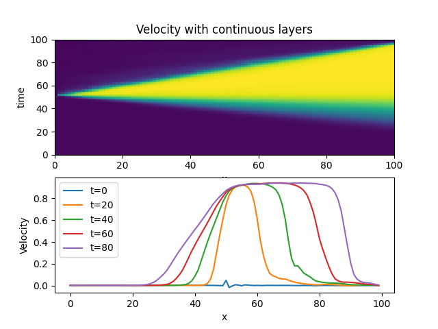

# neural-network-pdes
Neural Network Implicit Representation of Partial Differential Equations.  The problems here are solved using a simple high order MLP where
the the input is (x,t) in 1D and the output is density, velocity and pressure.  The loss function is partial differential equation for the 1d euler equations of gas dynamics dotted with itself.  The resulting model contains the entire solution at every time point and every space point between start and end.


## Euler equations

$$ 
\frac{\partial}{\partial t} \left[ \begin{array}{c} 
\rho \\
\rho v \\
e \\
\end{array}\right]+
\frac{\partial}{\partial x} \left[
\begin{array}{c}
\rho v \\
\rho v^{2}+p \\
\left(e+p\right)v
\end{array}\right]
=r
$$

where r=0.  The PDE is used as the loss function and r is the residual so that $loss=r\cdot r$.


## Sod Shock

"Solutions" to the Sod Shock problem in fluid dynamics, which is 1 dimensional ideal compressible gas dynamics (euler equations), a very classic problem.  Solutions need to be much better (and faster) before I try and extend to much more complicated systems. I'll try and improve on this as I have time.

## Fourier layers
The solution at t=0 should be a step function.  The model need to learn the initial conditions as well as all
the boundary conditions and the interior solution.  You can see here the initial condition is not perfect.


### Continuous piecewise polynomial layers




### Discontinuous piecewise polynomial layers

In this case it gets
the initial condition almost exactly right and can produce genuine discontinuities, but it's clearly showing many wrong and entropy violating shocks (not to mention not conserving mass etc...).  I need to add some penalty function here to prevent bad shocks.  This one converged the fastest by far.  The wave reflects
at the boundary as I'm using dirichlet bcs for now.  I believe this is the best long term approach if I can get rid of these various problems.


### Following [SIRENS](https://arxiv.org/abs/2006.09661) style network
SIRENS is just a standard MLP with a sinusoidal positional embedding at the input and sin wave activation functions.  In
this particular case the model has 8 hidden layers where each hidden layer is 100 units wide.


## Training
High order MLP
```
python examples/high_order_euler.py
```
Standard MLP following [SIRENS](https://arxiv.org/abs/2006.09661) with sin waves and sin wave positional embedding.
```
python examples/sirens_euler.py
```
## Plotting
```
python examples/high_order_euler.py checkpoint=\"outputs/2021-04-25/18-54-45/lightning_logs/version_0/checkpoints/'epoch=0.ckpt'\" train=False
```
## Running tests
```
pytest tests
```

## Papers of interest
Papers for me to read solving similar problems
[Solving Hydrodynamic Shock-Tube Problems Using Weighted Physics-Informed Neural Networks with Domain Extension](https://www.researchgate.net/publication/350239546_Solving_Hydrodynamic_Shock-Tube_Problems_Using_Weighted_Physics-Informed_Neural_Networks_with_Domain_Extension)