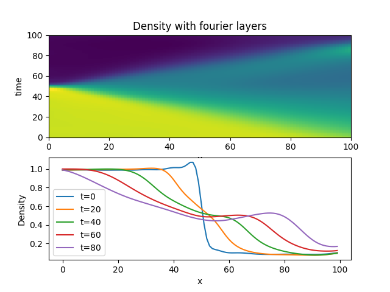
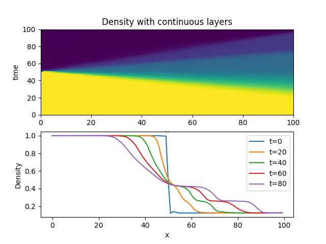

# neural-network-pdes
Neural Network Implicit Representation of Partial Differential Equations.  The images are very diffuse solutions to the Sod Shock problem in fluid dynamics, which is 1 dimensional ideal compressible gas dynamics (euler equations), a very classic example.  The solution takes a long time to get to, but if nothing else, shows that this problem can probably be solved using implicit representation.  I'm using fourier layers in the example below and you can see a rise in density before the "shock", that density rise should not be there...  I'll continue to try and refine this to get better solutions.  However the, "shock" and rarefaction wave are visible.




and with continuous piecewise polynomial layers




and with discontinuous piecewise polynomials.  In this case it gets
the initial condition almost exactly right and can produce genuine discontinuities, but it's clearly showing many wrong and entropy violating shocks (not to mention not conserving mass etc...).  I need to add some penalty function here to prevent bad shocks.  This one converged the fastest by far.  The wave reflects
at the boundary as I'm using dirichlet bcs for now.  I believe this is the best long term approach if I can get rid of these various problems.


## Training
```
python examples/euler.py gpus=0 mlp.periodicity=2
```

## Plotting
```
python examples/euler.py checkpoint=\"outputs/2021-04-25/18-54-45/lightning_logs/version_0/checkpoints/'epoch=0.ckpt'\" train=False
```

## Running tests
```
pytest tests
```