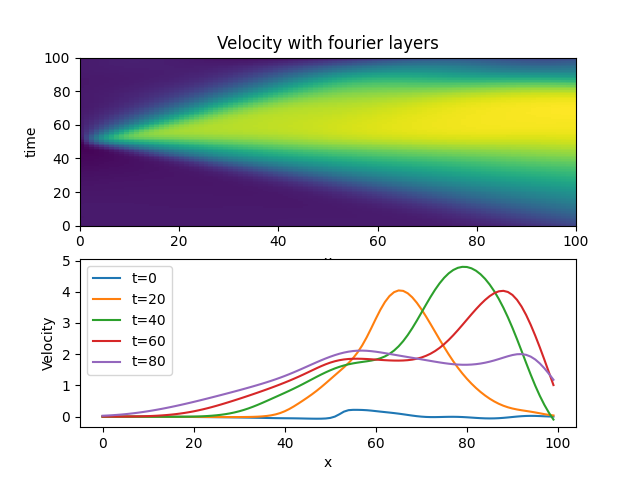

# neural-network-pdes
Neural Network Implicit Representation of Partial Differential Equations.  The problems here are solved using a simple high order MLP where
the the input is (x,t) in 1D and the output is density, velocity and pressure.  The loss function is partial differential equation for the 1d euler equations of gas dynamics dotted with itself.  The resulting model contains the entire solution at every time point and every space point between start and end.

## Installation
```bash
uv sync
```
To include dev dependencies:
```bash
uv sync --all-extras
```


## Euler equations

$$ 
\frac{\partial}{\partial t} \left[ \begin{array}{c} 
\rho \\
\rho v \\
e \\
\end{array}\right]+
\frac{\partial}{\partial x} \left[
\begin{array}{c}
\rho v \\
\rho v^{2}+p \\
\left(e+p\right)v
\end{array}\right]
=r
$$

where r=0.  The PDE is used as the loss function and r is the residual so that $loss=r\cdot r$.


## Sod Shock

"Solutions" to the Sod Shock problem in fluid dynamics, which is 1 dimensional ideal compressible gas dynamics (euler equations), a very classic problem.  Solutions need to be much better (and faster) before I try and extend to much more complicated systems. I'll try and improve on this as I have time.

## Fourier layers
The solution at t=0 should be a step function.  The model need to learn the initial conditions as well as all
the boundary conditions and the interior solution.  You can see here the initial condition is not perfect.




### Continuous piecewise polynomial layers
This is actually the 5th order polynomial (not 6th) using 12 layers and mesh refinement. Shocks aren't sharp enough to call it good.
```
python examples/high_order_euler.py mlp.hidden.width=20 max_epochs=10000 mlp.segments=2 mlp.n=2 mlp.hidden.layers=12 factor=0.025 mlp.layer_type=continuous optimizer.patience=200000 mlp.input.segments=10 batch_size=2048 form=primitive loss_weight.discontinuity=0.0 loss_weight.interior=1.0 optimizer=adam mlp.normalize=maxabs mlp.rotations=4 gradient_clip=0.0 loss_weight.boundary=10 loss_weight.initial=10 data_size=10000 mlp.resnet=False refinement.type=p_refine refinement.epochs=500 refinement.target_n=6 refinement.start_n=2
```


### Discontinuous piecewise polynomial layers

In this case it gets
the initial condition almost exactly right and can produce genuine discontinuities, but it's clearly showing many wrong and entropy violating shocks (not to mention not conserving mass etc...).  I need to add some penalty function here to prevent bad shocks.  This one converged the fastest by far.  The wave reflects
at the boundary as I'm using dirichlet bcs for now.  I believe this is the best long term approach if I can get rid of these various problems.


### Following [SIRENS](https://arxiv.org/abs/2006.09661) style network
SIRENS is just a standard MLP with a sinusoidal positional embedding at the input and sin wave activation functions.  In
this particular case the model has 8 hidden layers where each hidden layer is 100 units wide.


## Good parameters - still no contact discontinuity
Using quadratic polynomial creates a sharper shock. Using a large number of input segments (20) and then
just 2 for each following layer produces smooth results (no contact discontinuity though!). Primitive form
of the equations seems to be working better than conservative form - conservative form pushes to the initial condition even when dropping loss weight at shocks (possible I've introduced another error in my code).
```
python examples/high_order_euler.py mlp.hidden.width=40 max_epochs=10000 mlp.segments=2 mlp.n=3 mlp.hidden.layers=2 factor=0.1 mlp.layer_type=continuous optimizer.patience=200 mlp.input.segments=20 batch_size=512 form=primitive loss_weight.discontinuity=1.0 loss_weight.interior=0.1 optimizer=adamw
```
and, adding additional rotations
```
python examples/high_order_euler.py mlp.hidden.width=40 max_epochs=10000 mlp.segments=2 mlp.n=3 mlp.hidden.layers=2 factor=0.1 mlp.layer_type=discontinuous optimizer.patience=200 mlp.input.segments=20 batch_size=512 form=primitive loss_weight.discontinuity=1.0 loss_weight.interior=0.1 optimizer=adamw mlp.normalize=maxabs mlp.rotations=4
```
better (starting to see a contact discontinuity - unfortunately it's showing up in pressure as well)
```
python examples/high_order_euler.py mlp.hidden.width=40 max_epochs=10000 mlp.segments=4 mlp.n=4 mlp.hidden.layers=4 factor=0.025 mlp.layer_type=continuous optimizer.patience=200 mlp.input.segments=20 batch_size=512 form=primitive loss_weight.discontinuity=0.0 loss_weight.interior=1.0 optimizer=adam mlp.normalize=maxabs mlp.rotations=4 gradient_clip=5.0 loss_weight.boundary=10 loss_weight.initial=10 data_size=10000
```
more better - note that adamw seems to work faster as well as larger batch size batch_size=2048 > 512 > 128. Number of rotations doesn't seem
to be a huge issue as long as its > 1.
```
python examples/high_order_euler.py mlp.hidden.width=20 max_epochs=10000 mlp.segments=2 mlp.n=3 mlp.hidden.layers=3 factor=0.025 mlp.layer_type=continuous optimizer.patience=1000 mlp.input.segments=20 batch_size=2048 form=primitive loss_weight.discontinuity=0.0 loss_weight.interior=1.0e-1 optimizer=adamw mlp.normalize=maxabs mlp.rotations=6 gradient_clip=5.0 loss_weight.boundary=10 loss_weight.initial=10 data_size=10000 mlp.resnet=False
```
with polynomial refinement
```
python examples/high_order_euler.py mlp.hidden.width=20 max_epochs=10000 mlp.segments=4 mlp.n=3 mlp.hidden.layers=8 factor=0.025 mlp.layer_type=continuous optimizer.patience=200 mlp.input.segments=20 batch_size=2048 form=primitive loss_weight.discontinuity=0.0 loss_weight.interior=1.0e-1 optimizer=adamw mlp.normalize=maxabs mlp.rotations=6 gradient_clip=5.0 loss_weight.boundary=10 loss_weight.initial=10 data_size=10000 mlp.resnet=False refinement.type=p_refine refinement.epochs=1000
```
this one actually got the contact discontinuity, but the velocity is wrong
```
python examples/high_order_euler.py mlp.hidden.width=10 max_epochs=10000 mlp.segments=2 mlp.n=3 mlp.hidden.layers=8 factor=0.025 mlp.layer_type=continuous optimizer.patience=200 mlp.input.segments=20 batch_size=2048 form=primitive loss_weight.discontinuity=0.0 loss_weight.interior=1.0e-1 optimizer=adamw mlp.normalize=maxabs mlp.rotations=4 gradient_clip=5.0e-1 loss_weight.boundary=10 loss_weight.initial=10 data_size=10000 mlp.resnet=False refinement.type=p_refine refinement.epochs=1000
```
another with contact discontinuity and correct velocity, 8 layers and 10th order polynomial using refinement for subsequent initialization of each model.
```
python examples/high_order_euler.py mlp.hidden.width=20 max_epochs=10000 mlp.segments=2 mlp.n=2 mlp.hidden.layers=8 factor=0.025 mlp.layer_type=continuous optimizer.patience=200 mlp.input.segments=10 batch_size=2048 form=primitive loss_weight.discontinuity=0.0 loss_weight.interior=1.0e-1 optimizer=adamw mlp.normalize=maxabs mlp.rotations=4 gradient_clip=5.0e-1 loss_weight.boundary=10 loss_weight.initial=10 data_size=10000 mlp.resnet=False refinement.type=p_refine refinement.epochs=500 refinement.target_n=11
```
This one produced a pretty solid rarefaction wave, could be steeper (developed at 6th order) using "waves" approach.
```
python examples/high_order_euler.py mlp.hidden.width=20 max_epochs=10000 mlp.segments=2 mlp.n=2 mlp.hidden.layers=12 factor=0.025 mlp.layer_type=continuous optimizer.patience=200 mlp.input.segments=10 batch_size=2048 form=primitive loss_weight.discontinuity=0.0 loss_weight.interior=1.0e-1 optimizer=adamw mlp.normalize=maxabs mlp.rotations=4 gradient_clip=5.0e-1 loss_weight.boundary=10 loss_weight.initial=10 data_size=10000 mlp.resnet=False refinement.type=p_refine refinement.epochs=500 refinement.target_n=20 refinement.start_n=2
```
back to adam, which works fine with refinement at high order and with gradient clipping turned off.  May be problematic when doing high order without initializing from a lower order solution.  In this all the shock structure is there, shocks are just too smoothed out.
```
python examples/high_order_euler.py mlp.hidden.width=20 max_epochs=10000 mlp.segments=2 mlp.n=2 mlp.hidden.layers=8 factor=0.025 mlp.layer_type=continuous optimizer.patience=200000 mlp.input.segments=10 batch_size=2048 form=primitive loss_weight.discontinuity=0.0 loss_weight.interior=1.0e-1 optimizer=adam mlp.normalize=maxabs mlp.rotations=4 gradient_clip=0.0 loss_weight.boundary=10 loss_weight.initial=10 data_size=10000 mlp.resnet=False refinement.type=p_refine refinement.epochs=500 refinement.target_n=6 refinement.start_n=2
```
### With switch layer (gating)
Nothing to see below, runs but doesn't converge. Probably some different normalization.
```
python examples/high_order_euler.py mlp.hidden.width=20 max_epochs=10000 mlp.segments=2 mlp.n=5 mlp.hidden.layers=1 mlp.layer_type=switch_discontinuous optimizer.patience=200000 mlp.input.segments=10 batch_size=2048 form=primitive loss_weight.discontinuity=0.0 loss_weight.interior=1.0e-1 optimizer=adam mlp.normalize=maxabs mlp.rotations=4 gradient_clip=0.0 loss_weight.boundary=10 loss_weight.initial=10 data_size=10000 mlp.resnet=True
```
## Training
High order MLP
```
python examples/high_order_euler.py
```
Standard MLP following [SIRENS](https://arxiv.org/abs/2006.09661) with sin waves and sin wave positional embedding.
```
python examples/sirens_euler.py
```
## Plotting
```
python examples/high_order_euler.py checkpoint=\"outputs/2021-04-25/18-54-45/lightning_logs/version_0/checkpoints/'epoch=0.ckpt'\" train=False
```
## Running tests
```
pytest tests
```

## Papers of interest
Papers for me to read solving similar problems

[Solving Hydrodynamic Shock-Tube Problems Using Weighted Physics-Informed Neural Networks with Domain Extension](https://www.researchgate.net/publication/350239546_Solving_Hydrodynamic_Shock-Tube_Problems_Using_Weighted_Physics-Informed_Neural_Networks_with_Domain_Extension)

[Discontinuity Computing using Physics Informed Neural Networks](https://www.researchgate.net/profile/Li-Liu-72/publication/359480166_Discontinuity_Computing_using_Physics-Informed_Neural_Networks/links/6312a7da5eed5e4bd1404c25/Discontinuity-Computing-using-Physics-Informed-Neural-Networks.pdf)

[ACTIVE LEARNING BASED SAMPLING FOR HIGH-DIMENSIONAL NONLINEAR PARTIAL DIFFERENTIAL EQUATIONS](https://arxiv.org/pdf/2112.13988.pdf)

[Conservative physics-informed neural networks on discrete domains for conservation laws: Applications to forward and inverse problems]()